## Field declaration

### Common properties

#### `accessor`

Each field declaration should have `accessor` property specified. This field describes path to a field data in common data map. `accessor` property is a string.

For example we have this data map: 
```javascript
    {
        "ID": 123456,
        "NAME": "Coca Cola",
        "DEPARTMENT": {
            "ID": 234567,
            "NAME": "Cold drinks",
            "CATEGORY": {
                "ID": 345678,
                "NAME": "Non-alcohol drinks",
                ...
            },
            ...
        },
        ...
    }
```

Lets use few accessors to this data map
- `"NAME"` will return `"Coca Cola"`
- `"DEPARTMENT.ID"` will return `234567`
- `"DEPARTMENT.CATEGORY.NAME"` will return `"Non-alcohol drinks"`

**Be careful - accessors are case sensitive!**

#### `type`

Each field should have `type` property specified. All available field types are described below. If `type` property is ommited, this field will be displayed as `Text input` field.

#### `label`

All fields can have `label` property specified. If it so there will be field label displayed before field.

#### `group`

Using 'group' propertyu you can place fields to a different groups. 
All groups will be displayed separately in form's sections. 
You can set groups headers with 'formgroups' declaration type. 
If group not specified ot will be placed in default group;

#### span

With `span` field property you can customize form section view. Each form group is a grid with 6 same width columns. By specifing `span` property with number from 1 to 6 you can set number of spanned grid columns. Thanks to this you can do such forms:

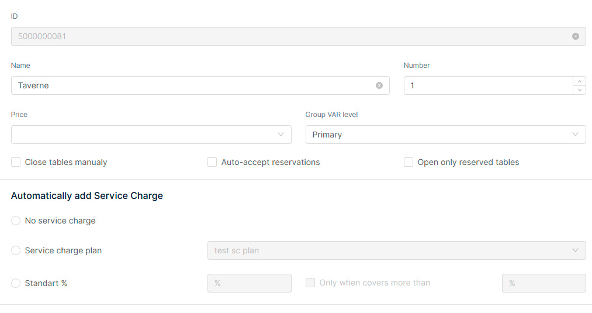

#### order

`order` property sets and order of field in one group. If `order` field not specified the fields will be arranged in accordance of adding to the group.

#### value

Default field value.

#### tip

If this property was specified a field tip will be rendered next to the field's label. If label not specified tip will be rendered next to the field

#### common

This property indicates whether this field can be changed for the numerous of locations at once.

#### required

Indicates wheter this field is required in edit form. This field is one of "**validation fields**" group.

#### validation fields

This is a group of field properties, that join up next fields:
- `required`
- `regexp`
- `minLength`
- `maxLength`
- `min`
- `max`

All this fields a participate in field's data validation and can be accepted to any field of any type, but in most cases only `required` field will be more useful to all fields. Other validation properties will be useful based on field type.

# Field Types:
Field types used by Form Edit components (not full list)

## Base Types
Base types is common field types, that:
1. Uses simple UI components to iteract with them
2. Uses only one data-provider ( Article name, Description, Color etc.)

#### Text input
Simple text input. Can display strings and numbers.
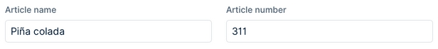
`Properties:`
```javascript
{
    "type": "text" | 'textarea' | "email" | "password",
    "placeholder": String, // field's placeholder
    "value": String | Number, //default value
    "regexp" String, // regular expression to validate
    "label": String, // if specified will show a field's label before field
    "width": Number, // static width of a field
    "disabled": Boolean | Function,
    "group": String,
    "required": Boolean, // if true field is required
    "tip": String, // if specified will show a tip near label. if label undefined tip will be placed next to the field
    "accessor": String, // path to data in DATA map. Examples: "NAME"; "DEPARTMENT.ID"; "DEPARTMENT.CATEGORY.NAME" etc.
    "minLength": Number, // minimum text length
    "maxLength": Number, // maxiumu text length
    "common": Boolean, // if true this field will be available to change for multy locations
    "addonAfter": String || JSX, // show block with specified content after field
    "addonBefore": String, // show block with specified content before field
    "prefix": String, // show text inside field before entered text
    "suffix": String,// show text inside field after entered text
    "allowClear": Boolean // true by default
    "size": "small" | "default" | "large", 
    "span": Number, //number of spanned columns. maximum value is 6
    "header": String //used if field is part of tabs group
}
```

Example: 

```javascript
manager.registerContribution(TYPE_SECTIONS, 'salesAreasGeneral', 'fields', {
    "type": "text",
    "label": "Name",
    "required": true,
    "accessor": "name",
    "span": 4,
    "common": true
});
```

#### Number spinner
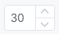
`Properties:`
```javascript
{
    "type": "number",
    "label": String,
    "value": Number, // default value
    "precision": Number, // Integer. indicates how many decimal places to display
    "min": Number, // maximum value
    "max": Number, // minimum value
    "step": Number, // step of itteration. default is 1
    "disabled": Boolean | Function,
    "group": String,
    "name": String,
    "required": Boolean,
    "tip": String,
    "accessor": String, // data to value
    "common": Boolean,
    "parser": Function, // Specifies the value extracted from formatter
    "formatter": Function, // Specifies the format of the value presented
    "span": Number
}
```

Example:

```javascript
manager.registerContribution(TYPE_SECTIONS, 'SalesRangeGeneral', 'fields', {
    "type": "number",
    "label": "From",
    "required": true,
    "accessor": "RANGE_FROM",
    "span": 3,
    "value": 0,
    "min": 0
});
```

#### Text area 
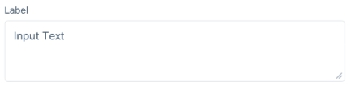
`Properties:`
```javascript
{
    "type": "textarea",
    "placeholder": String,
    "value": String | Number,
    "regexp" String,
    "label": String,
    "width": Number,
    "resizable": Boolean,
    "disabled": Boolean | Function,
    "group": String,
    "name": String,
    "required": Boolean,
    "tip": String,
    "accessor": String, // data to value
    "common": Boolean,
    "span": Number,
    "allowClear": Boolean
}
```
Example:

```javascript
manager.registerContribution(TYPE_SECTIONS, 'usersPersonal', 'fields', {
    "type": "textarea",
    "label": "Address",
    "accessor": "address",
    "span": 6
});
```

#### Checkbox

`Properties:`
```javascript
{
    "type": "checkbox",
    "label": String,
    "text": String, // text of the checkbox
    "value": Boolean,
    "disabled": Boolean | Function,
    "group": String,
    "name": String,
    "required": Boolean,
    "tip": String,
    "accessor": String, // data to value
    "common": Boolean,
    "span": Number 
}
```

Example:
```javascript
manager.registerContribution(TYPE_SECTIONS, 'salesAreasGeneral', 'fields', {
    "type": "checkbox",
    "text": "Only when covers more than",
    "accessor": "if_covers",
    "span": 2,
    "group": "sa-service-charge-group",
    "disabled": (field, data) => data.sctype !== 2
});
```

#### Select

`Properties:`
```javascript
{
    "type": "select",
    "label": String,
    "placeholder": String,
    "value": String | Number,
    "options": Object | Array,
    "disabled": Boolean | Function,
    "group": String,
    "name": String,
    "width": Number,
    "required": Boolean,
    "tip": String,
    "accessor": String, // data to value
    "value_accessor": String, // if specified will take a value by this path from object as option value;
    "text_accessor": String, // if specified will take a value by this path from object as option text
    "common": Boolean,
    "manual": Boolean, //if true fetch data when field component is mounted
    "fetchUrl": { // this property will be used to fetch data in manual mode.
        "query": String,
        "path": String,
        "params": Object,
        "method": String
    },
    "selector": String | Object, //path to options data in entityData? returned by api request
    "reducer": Function, // required property. converts data given by "selector" property to key:value map (object).
    "span": Number,
    "search": Boolean // if "true" the search via options will be available
}
```

Example: 

```javascript
manager.registerContribution(TYPE_SECTIONS, 'SalesAreaExceptionsGeneral', 'fields', {
    "type": "select",
    "label": "Period",
    "placeholder": 'Please select period',
    "accessor": "ID_PERIODS",
    "selector": "periods",
    "reducer": (data) => _.chain(data).keyBy('ID').mapValues('NAME').value(),
    "span": 3,
    "required": true
});
```

#### Radio button

`Properties:`
```javascript
{
    "type": "radio",
    "value": String | Number,
    "label": String,
    "text": String, // text of radio button
    "disabled": Boolean | Function,
    "group": String,
    "required": Boolean,
    "tip": String,
    "accessor": String, // data to value
    "common": Boolean,
    "span": Number
}
```

Example: 

```javascript
manager.registerContribution(TYPE_SECTIONS, 'salesAreasGeneral', 'fields', {
    "type": "radio",
    "text": "No service charge",
    "accessor": "sctype",
    "value": 0,
    "span": 6,
    "group": "sa-service-charge-group"
});
```

#### Radio buttons group

`Properties:`
```javascript
{
    "type": "radiogroup",
    "value": String | Number,
    "label": String,
    "disabled": Boolean | Function,
    "group": String,
    "required": Boolean,
    "tip": String,
    "accessor": String, // data to value
    "common": Boolean,
    "options": Object [value: text],
    "span": Number
}
```

Example: 

```javascript
manager.registerContribution(TYPE_SECTIONS, 'usersGeneral', 'fields', {
    "type": "radiogroup",
    "label": "Hand",
    "accessor": "lefthand",
    "required": true,
    "span": 3,
    "group": "gr-3",
    "options": {
        "Right": 0,
        "Left": 1
    },
    "value": 0
});
```

#### Color picker 
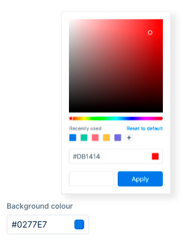
`Properties:`
```javascript
{
    "type": "color",
    "picker": String //type of color picker,
    "label": String,
    "value": Number,
    "min": Number,
    "max": Number,
    "step": Number,
    "disabled": Boolean | Function,
    "group": String,
    "name": String,
    "required": Boolean,
    "tip": String,
    "accessor": String, // data to value
    "common": Boolean,
    "span": Number
}
```

`picker` property can be one of the following values:
- `block`
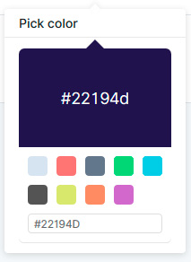
- `chrome`
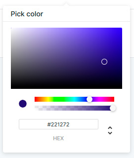
- `circle`
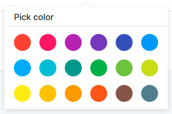
- `compact`
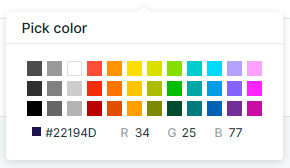
- `github`
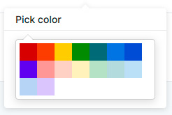
- `hue`
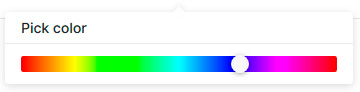
- `material`
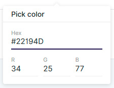
- `photoshop`
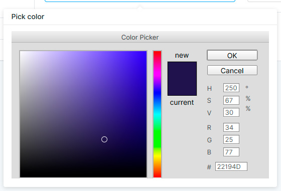
- `sketch`
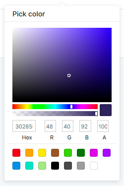
- `slider`
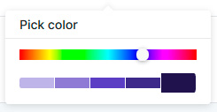
- `swatches`
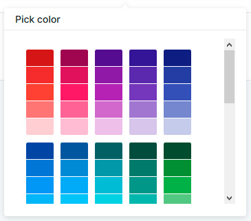
- `twitter`
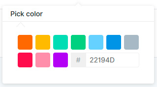

`alpha` is default value

Example: 

```javascript
manager.registerContribution(TYPE_SECTIONS, 'discountsAppearance', 'fields', {
    "type": "color",
    "label": "Background color",
    "accessor": "color",
    "picker": "sketch",
    "span": 2
});
```

#### Tip

`Properties:`
```javascript
{
    "type": "tip",
    "text": String,
    "label": String,
    "group": String,
    "span": Number
}
```

#### Embedded manager
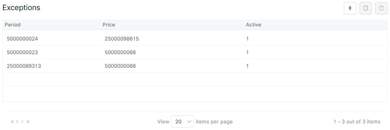

`Properties:`
```javascript
{
    "type": "embedded",
    "label": String,
    "header": String,
    "value": String,
    "disabled": Boolean | Function,
    "group": String,
    "required": Boolean,
    "tip": String,
    "entity": String, // required prop. Name of embedded entity manager class
    "accessor": String, // data to value
    "common": Boolean,
    "span": Number
}
```

Example: 

```javascript
manager.registerContribution(TYPE_SECTIONS, 'salesAreasGeneral', 'fields', {
    "type": "embedded",
    "entity": "SalesAreaExceptions",
    "header": "Exceptions",
    "required": false,
    "span": 6,
    "accessor": "exceptions",
    "group": "sa-emanagers"
});
```

#### Embedded selector
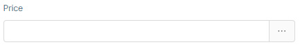
*Opened variant:*
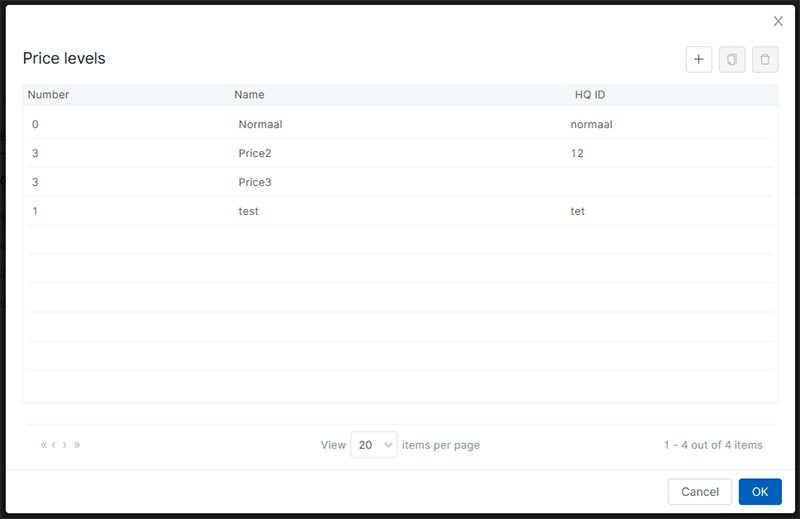

`Properties:`
```javascript
{
    "type": "embedded_selector",
    "label": String,
    "header": String,
    "value": String,
    "disabled": Boolean | Function,
    "group": String,
    "required": Boolean,
    "tip": String,
    "entity": String, // required prop. Name of embedded entity manager class
    "accessor": String, 
    "field_accessor": String //seletor of a field data to be returned
    "common": Boolean,
    "span": Number
}
```

Example: 

```javascript
manager.registerContribution(TYPE_SECTIONS, 'SalesAreaExceptionsGeneral', 'fields', {
    "type": "embedded_selector",
    "header": "Price levels",
    "entity": 'PriceLevels',
    "label": "Price",
    "accessor": "ID_PRICES",
    "field_accessor": "ID",
    "span": 3,
    "required": true
});
```

## Composite types
Composite types is types that:
1. uses UI components
2. uses different data-providers
3. both

#### Location selector
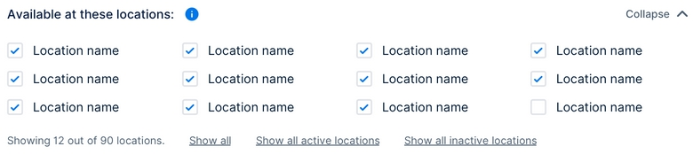
`Properties:`
```javascript
{
    "disabled": Boolean | Function,
    "group": String,
    "required": Boolean,
    "tip": String,
    "accessor": String, // data to value
    "common": Boolean,
    "span": Number
}
```

#### List
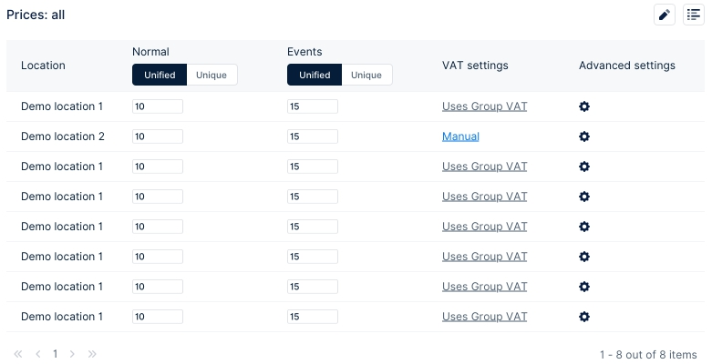
`Properties:`
```javascript
{
    "disabled": Boolean | Function,
    "group": String,
    "required": Boolean,
    "tip": String,
    "accessor": String, // data to value
    "common": Boolean,
    "span": Number
}   
```

#### Button view
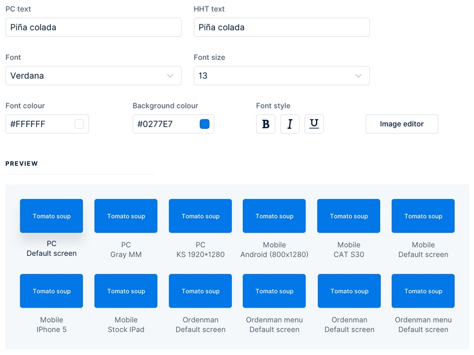
`Properties:`
```javascript
{
    "disabled": Boolean | Function,
    "group": String,
    "required": Boolean,
    "tip": String,
    "accessor": String, // data to value
    "common": Boolean,
    "span": Number
}
```

#### Image selector

`Properties:`
```javascript
{
    "disabled": Boolean | Function,
    "group": String,
    "required": Boolean,
    "tip": String,
    "accessor": String, // data to value
    "common": Boolean,
    "span": Number
}
```

## Special types
Special data types, that behave with module itself not with backoffice database

#### Editing mode selector

`Properties:`
```javascript
{
    "tip": String,
    "common": Boolean,
    "span": Number
}
```