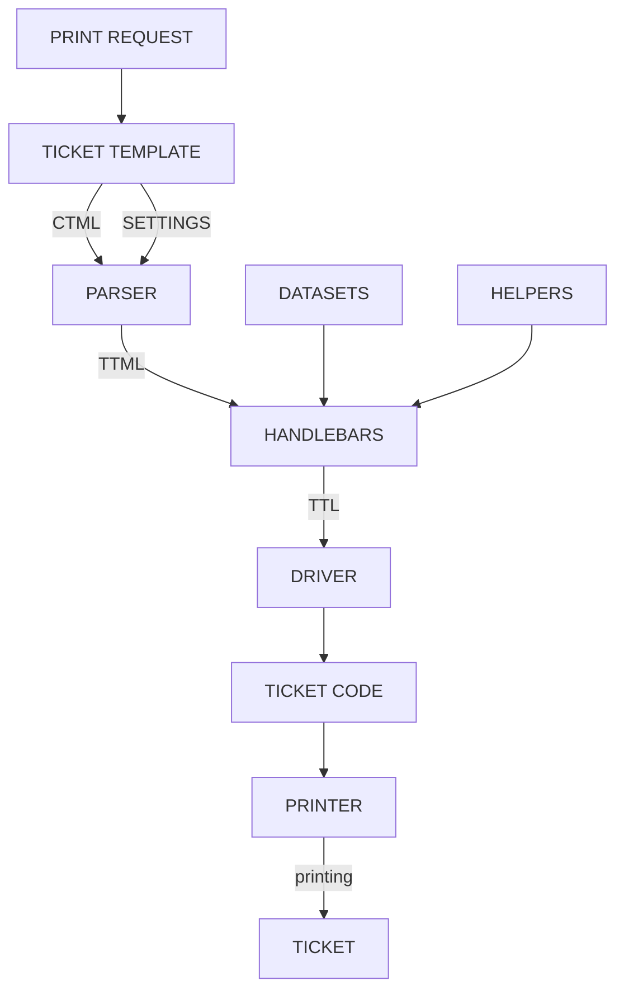

### Overview

There is two core definition related to printing: Tickets and Printers.

**Only ESC/POS printers will be used.**

### Printers

- Table in "unTill" database  - PRINTERS
- Should use existing table to "unTill air" printers
- Only TCP/IP printers will be available at this moment
- Other printer types not specified yet
- Each printer will have next properties:
    - Type (only TCP/IP available)
    - Port
    - IP
    - Output ticket width
    - Printer driver 
    - Codding page
- `Printer -> Ticket` dependencies should be specified in device properties

### Tickets

- Table in "unTill" database  - TICKETS
- Should use existing table to unTill air printers
- In some countries ability to create custom tickets will be blocked. For this countries special hardcoded tickets will be used ( legal tickets). This is due to severe tax restrictions.
- При создании тикета у пользоавтеля есть возможность указать следующие данные:
    - Ticket template name
    - Ticket width (clarify information)
    - Ticket layout - hardcoded in backoffice.
    - Depending on selected layout different settings sets will be shown to user.
- Each Layout specifies:
    - Layout template version - целое число - должна изменяться при изменении шаблона для того, чтобы в системе указывать, если изменился шаблон у тикета и давать возможность его изменить.
    - Base layout template writen on `CTML`
    - Settings for customizing base layout. Can be devided into groups
    - Helper functions used by CTML-compliler into `TTML`
- Result ticket template should be saved with record type `ticket`. In the `content` field of record's 'value' blob will be passed a blob with next structure:
    - First four bytes sp[ecifies ticket type - new or old 'untill'
    - After that JSON is passed.
        - template - base layout template
        - templateVersion - layout version
        - templateId - layout id
        - settings - JSON object

### Get started

1. Create printer
2. Create ticket template
    1. Enter ticket template name
    2. Select ticket layout
    3. Setup layout settings
3. Setup printer -> ticket dependecie in device settings

        
### In POS

`CTML` - Conditional Ticket Markup Language
`TTML` - Ticket Template Markup Language
`TTL` - Ticket Template Language
`HANDLEBARS` - Parsing utility